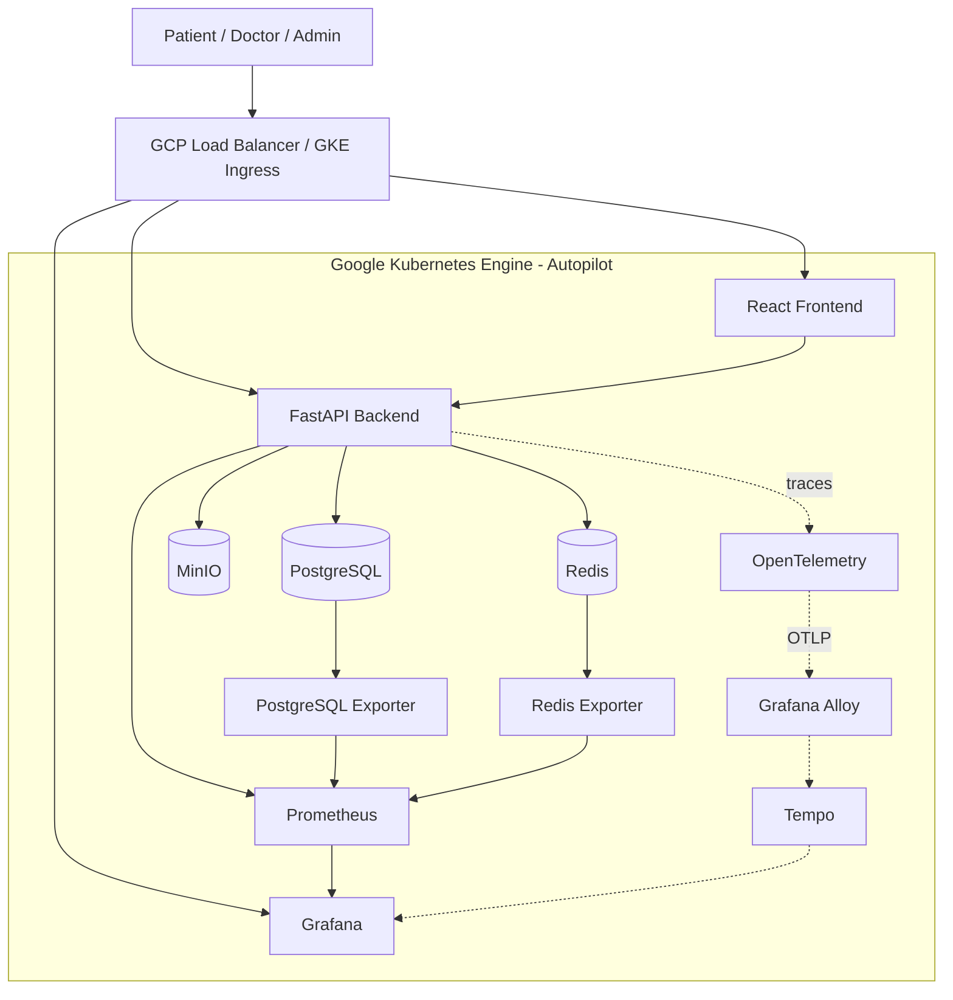

# MediFlow AI Enterprise

Cloud-native healthcare platform built with React, FastAPI, PostgreSQL, Redis, Kubernetes, GKE, Helm, Prometheus, Grafana, OpenTelemetry, and CI/CD.

MediFlow AI Enterprise is a production-style healthcare SaaS project designed to demonstrate full-stack engineering, DevOps, cloud infrastructure, observability, and Site Reliability Engineering concepts in one end-to-end platform.

---

## Overview

MediFlow supports three primary user roles:

* Patient
* Doctor
* Administrator

The platform goes beyond a traditional CRUD application by combining healthcare workflows with:

* Authentication and authorization
* REST APIs
* Cloud-native deployment
* Container orchestration
* CI/CD
* Monitoring and observability
* Failure detection and recovery
* Infrastructure and platform engineering

The frontend is built with React, TypeScript, and Vite. The backend uses Python, FastAPI, and SQLAlchemy.

PostgreSQL provides persistent storage, Redis supports low-latency data access, and MinIO provides S3-compatible document storage.

The application is deployed on Google Kubernetes Engine using Helm. Prometheus collects telemetry, Grafana provides dashboards, and PostgreSQL and Redis exporters expose service-level metrics.

An administrator-only Operations Command Center surfaces application and infrastructure health directly inside the MediFlow UI.

> MediFlow is a portfolio-grade engineering project. It is not presented as a certified healthcare system or as compliant with a specific healthcare regulation.

---

## Key Features

### Patient

Patients can:

* Sign in securely
* View a personalized dashboard
* Browse doctors and departments
* Book appointments
* Reschedule or cancel appointments
* View consultation history
* View prescriptions
* Upload and download medical documents
* Request an AI-generated health summary
* Manage profile information

### Doctor

Doctors can:

* Sign in securely
* View scheduled appointments
* Manage availability
* Confirm appointments
* Open consultation sessions
* Record diagnoses
* Add clinical notes
* Create prescriptions
* Complete consultations

Completed consultations become part of the patient's medical history.

### Administrator

Administrators can:

* View platform-level information
* Manage users
* Manage doctors
* Review appointments
* Inspect audit logs
* Access the Operations Command Center
* View Grafana dashboards
* Monitor platform health

---

## Engineering Highlights

* React and TypeScript frontend
* Python and FastAPI backend
* PostgreSQL persistence
* Redis integration
* MinIO object storage
* JWT authentication
* Server-side RBAC
* Dockerized workloads
* Kubernetes deployment
* GKE Autopilot
* Helm-based release management
* GCP Load Balancer and Ingress
* GitHub Actions CI/CD
* Prometheus monitoring
* Grafana dashboards
* PostgreSQL Exporter
* Redis Exporter
* Application health aggregation
* Failure and recovery testing
* OpenTelemetry instrumentation
* Grafana Alloy and Tempo integration
* Operational and audit logging

---

## Architecture



---

## Request Flow

```text
Browser
   |
   v
GCP Load Balancer
   |
   v
GKE Ingress
   |
   +----------------+----------------+
   |                |                |
   v                v                v
Frontend         Backend          Grafana
React/NGINX      FastAPI
                    |
             +------+------+
             |      |      |
             v      v      v
        PostgreSQL Redis  MinIO
```

---

## Observability Flow

```text
FastAPI /metrics -----------+
PostgreSQL Exporter --------+--> Prometheus --> Grafana
Redis Exporter -------------+
                                     |
                                     v
                          Observability API
                                     |
                                     v
                         Operations Command Center
```

The frontend does not communicate directly with Prometheus.

Monitoring queries are handled by the FastAPI backend so authentication, authorization, PromQL interpretation, and service-health normalization remain server-side.

---

## Technology Stack

| Area                | Technologies                        |
| ------------------- | ----------------------------------- |
| Frontend            | React, TypeScript, Vite             |
| Backend             | Python, FastAPI, SQLAlchemy         |
| Database            | PostgreSQL                          |
| Cache               | Redis                               |
| Object Storage      | MinIO                               |
| Authentication      | JWT                                 |
| Authorization       | RBAC                                |
| Containers          | Docker                              |
| Orchestration       | Kubernetes                          |
| Cloud               | Google Cloud Platform               |
| Kubernetes Platform | GKE Autopilot                       |
| Deployment          | Helm                                |
| Networking          | GKE Ingress, GCP Load Balancer      |
| Monitoring          | Prometheus                          |
| Visualization       | Grafana                             |
| Database Metrics    | PostgreSQL Exporter                 |
| Redis Metrics       | Redis Exporter                      |
| Tracing             | OpenTelemetry, Grafana Alloy, Tempo |
| CI/CD               | GitHub Actions                      |
| Source Control      | Git, GitHub                         |

---

## Authentication and Authorization

Authentication is based on JSON Web Tokens.

```text
POST /api/auth/login
        |
        v
Validate credentials
        |
        v
Generate JWT
        |
        v
Client sends Bearer token
        |
        v
FastAPI resolves current user
        |
        v
RBAC validates required role
```

Protected endpoints use backend dependencies such as:

```python
Depends(current_user)

Depends(require_roles("patient"))

Depends(require_roles("doctor"))

Depends(require_roles("admin"))
```

Authorization is enforced on the server rather than only by hiding frontend elements.

---

## API Areas

The backend exposes APIs for:

```text
/api/auth/*
/api/me
/api/departments
/api/doctors
/api/slots/*
/api/appointments/*
/api/doctor/appointments/*
/api/medical-records
/api/documents/*
/api/ai/summary
/api/admin/*
/api/admin/observability/summary
/health
/metrics
```

---

## GKE Environment

Development environment:

```text
GCP Project  : mediflow-ai-enterprise
Region       : asia-south1
Namespace    : mediflow-dev
Helm Release : mediflow
Cluster      : GKE Autopilot
```

Major workloads include:

```text
mediflow-mediflow-app-backend
mediflow-mediflow-app-frontend
postgres
redis
minio
prometheus
grafana
postgres-exporter
redis-exporter
```

---

## Kubernetes

The project uses standard Kubernetes resources including:

* Deployments
* Pods
* Services
* Ingress
* ConfigMaps
* Secrets
* Readiness probes
* Liveness probes
* Rolling deployments
* Service discovery

GKE Autopilot manages much of the underlying node lifecycle while still allowing the project to use standard Kubernetes abstractions.

---

## Helm

MediFlow is packaged using Helm.

Example deployment:

```powershell
helm upgrade mediflow `
  .\deployments\helm\mediflow-app `
  -n mediflow-dev `
  -f values-gke-dev.yaml
```

---

## Networking

Development hosts:

```text
Frontend : http://dev.mediflow.example.com
API      : http://api-dev.mediflow.example.com
Grafana  : http://grafana-dev.mediflow.example.com
```

Traffic flow:

```text
Internet
   |
   v
GCP Load Balancer
   |
   v
GKE Ingress
   |
   +----------------+----------------+
   |                |                |
   v                v                v
Frontend         Backend          Grafana
Service          Service          Service
```

---

## Observability

### Prometheus

Prometheus collects metrics from:

* FastAPI
* PostgreSQL Exporter
* Redis Exporter

The backend exposes metrics at:

```text
/metrics
```

---

### PostgreSQL Monitoring

PostgreSQL Exporter endpoint:

```text
postgres-exporter:9187
```

Important health metric:

```promql
pg_up
```

---

### Redis Monitoring

Redis Exporter endpoint:

```text
redis-exporter:9121
```

Important health metric:

```promql
redis_up
```

---

## Grafana

Grafana dashboards include:

* Hospital Operations
* Backend & API
* Database & Cache
* Infrastructure
* AI & Documents

These dashboards are also accessible from the administrator Operations workspace.

---

## Operations Command Center

The administrator Operations page calls:

```text
GET /api/admin/observability/summary
```

The backend aggregates monitoring information and returns normalized states.

Supported states:

```text
healthy
degraded
down
unknown
```

The Operations Command Center currently displays health for:

* API
* PostgreSQL
* Redis
* Prometheus
* Grafana
* Active alerts

These values are generated from actual monitoring telemetry rather than static UI data.

---

## Failure and Recovery Testing

The monitoring system was tested by intentionally taking Redis Exporter offline.

### Simulate Failure

```powershell
kubectl scale deployment redis-exporter `
  -n mediflow-dev `
  --replicas=0
```

Expected flow:

```text
Redis Exporter stopped
        |
        v
Prometheus target unavailable
        |
        v
Backend observability API detects failure
        |
        v
Operations Command Center reports degraded/down
```

### Restore Service

```powershell
kubectl scale deployment redis-exporter `
  -n mediflow-dev `
  --replicas=1
```

Verify recovery:

```powershell
kubectl rollout status deployment/redis-exporter `
  -n mediflow-dev `
  --timeout=120s
```

This test demonstrates real failure detection and recovery rather than hard-coded health cards.

---

## Distributed Tracing

The tracing architecture is designed around:

```text
FastAPI
   |
   v
OpenTelemetry
   |
   v
Grafana Alloy
   |
   v
Tempo
   |
   v
Grafana
```

A known issue currently exists with OTLP export toward:

```text
alloy:4317
```

where `StatusCode.UNAVAILABLE` has been observed.

This does not affect:

* Authentication
* Application APIs
* PostgreSQL
* Redis
* Prometheus
* Grafana
* CI/CD
* GKE deployment

Tracing is currently an enhancement area rather than a dependency for running the application.

---

## CI/CD

The deployment workflow follows:

```text
Code Change
   |
   v
Git Commit / Push
   |
   v
GitHub Actions
   |
   v
Validation and Build
   |
   v
Container Image
   |
   v
Container Registry
   |
   v
Helm Deployment
   |
   v
GKE
   |
   v
Health Verification
```

Typical local validation:

```powershell
python -m py_compile .\backend\app\main.py

python -m py_compile .\backend\app\observability.py

cd .\frontend

npm run build

cd ..

git diff --check

git status --short
```

---

## Repository Structure

```text
Mediflow-AI-Enterprise-main/
│
├── .github/
│   └── workflows/
│
├── backend/
│   └── app/
│       ├── main.py
│       ├── observability.py
│       ├── metrics.py
│       ├── security.py
│       └── ...
│
├── deployments/
│   ├── helm/
│   └── kubernetes/
│
├── docs/
│
├── frontend/
│   └── src/
│       ├── pages/
│       ├── api.ts
│       └── styles.css
│
├── infrastructure/
│
├── observability/
│
└── README.md
```

---

## Prerequisites

Install:

* Git
* Node.js
* npm
* Python 3.12+
* Docker
* kubectl
* Helm
* Google Cloud CLI

Verify:

```powershell
git --version
node --version
npm --version
python --version
docker --version
kubectl version --client
helm version
gcloud --version
```

---

## Environment Configuration

Typical backend configuration:

```env
DATABASE_URL=<postgresql-connection-string>
REDIS_URL=<redis-connection-string>
JWT_SECRET=<secret>
MINIO_ENDPOINT=<object-storage-endpoint>
MINIO_ACCESS_KEY=<access-key>
MINIO_SECRET_KEY=<secret-key>
```

Never commit real credentials, JWT secrets, database passwords, cloud credentials, or production `.env` files.

---

## Local Development

### Frontend

```powershell
cd frontend

npm install

npm run dev
```

Default URL:

```text
http://localhost:5173
```

Production build validation:

```powershell
npm run build
```

---

## Build Validation

Backend:

```powershell
python -m py_compile .\backend\app\main.py
```

Observability module:

```powershell
python -m py_compile .\backend\app\observability.py
```

Frontend:

```powershell
cd frontend

npm install

npm run build

cd ..
```

Git validation:

```powershell
git diff --check

git status --short

git --no-pager diff --stat
```

---

## Deployment Verification

Check Pods:

```powershell
kubectl get pods -n mediflow-dev
```

Check Services:

```powershell
kubectl get svc -n mediflow-dev
```

Check Ingress:

```powershell
kubectl get ingress -n mediflow-dev
```

Backend rollout:

```powershell
kubectl rollout status `
  deployment/mediflow-mediflow-app-backend `
  -n mediflow-dev `
  --timeout=120s
```

Frontend rollout:

```powershell
kubectl rollout status `
  deployment/mediflow-mediflow-app-frontend `
  -n mediflow-dev `
  --timeout=120s
```

---

## Monitoring Verification

### Prometheus

```powershell
kubectl exec -n mediflow-dev deploy/grafana -- `
  wget -qO- http://prometheus:9090/-/ready
```

### Redis

```powershell
kubectl exec -n mediflow-dev deploy/prometheus -- `
  wget -qO- http://redis-exporter:9121/metrics |
  Select-String "redis_up"
```

### PostgreSQL

```powershell
kubectl exec -n mediflow-dev deploy/prometheus -- `
  wget -qO- http://postgres-exporter:9187/metrics |
  Select-String "pg_up"
```

---

## CORS

FastAPI uses `CORSMiddleware`.

Development origins include:

```text
http://localhost:3000
http://localhost:5173
http://dev.mediflow.example.com
```

Validate a preflight request:

```powershell
curl.exe -i -X OPTIONS `
  "http://api-dev.mediflow.example.com/api/auth/login" `
  -H "Origin: http://dev.mediflow.example.com" `
  -H "Access-Control-Request-Method: POST" `
  -H "Access-Control-Request-Headers: content-type"
```

---

## Troubleshooting

### CORS Error

If the browser reports:

```text
No 'Access-Control-Allow-Origin' header is present
```

check that:

* The frontend origin is allowed by FastAPI
* The backend was rebuilt
* The correct backend image was deployed
* The browser is calling the expected API URL

---

### localhost:8000 Connection Refused

This usually means the frontend is configured to use a local backend that isn't running.

Either start the backend or update the frontend API configuration.

---

### 401 Unauthorized

Protected endpoints require a valid JWT and the correct role.

For example:

```text
/api/admin/observability/summary
```

requires an administrator account.

---

### UI Changes Not Visible

Check:

```powershell
git status --short

git log -1 --oneline

kubectl get pods -n mediflow-dev
```

Then confirm the CI/CD pipeline deployed the expected commit.

---

### Exporter Down

Redis:

```powershell
kubectl exec -n mediflow-dev deploy/prometheus -- `
  wget -qO- http://redis-exporter:9121/metrics
```

PostgreSQL:

```powershell
kubectl exec -n mediflow-dev deploy/prometheus -- `
  wget -qO- http://postgres-exporter:9187/metrics
```

---

## SRE Concepts Demonstrated

The project demonstrates:

* Health checks
* Readiness
* Liveness
* Metrics
* Logs
* Traces
* Monitoring
* Observability
* Prometheus exporters
* Scrape targets
* PromQL
* Grafana dashboards
* Failure injection
* Recovery testing
* RBAC
* CI/CD
* Rolling deployments
* Service discovery
* Kubernetes operations

---

## Demo Flow

A recommended demo sequence:

```text
Patient Workflow
      |
      v
Doctor Consultation
      |
      v
Admin Workflow
      |
      v
Operations Command Center
      |
      v
Grafana
      |
      v
Failure / Recovery Test
      |
      v
CI/CD
      |
      v
GKE Workloads
```

### Patient Demo

Show:

* Login
* Dashboard
* Doctor discovery
* Appointment booking
* Medical records
* Prescriptions
* Documents
* AI summary

### Doctor Demo

Show:

* Login
* Appointment workload
* Consultation workspace
* Diagnosis
* Clinical notes
* Prescription creation
* Consultation completion

### Admin Demo

Show:

* Admin dashboard
* User management
* Doctor management
* Appointments
* Audit logs
* Operations Command Center

### SRE Demo

Show:

* Grafana dashboards
* Prometheus
* Redis and PostgreSQL exporters
* Failure detection
* Service recovery
* Kubernetes workloads

---

## Current Status

Working components:

* Frontend
* FastAPI backend
* Authentication
* RBAC
* PostgreSQL
* Redis
* MinIO
* Patient workflows
* Doctor workflows
* Admin workflows
* GKE deployment
* Ingress
* CI/CD
* Prometheus
* Grafana
* PostgreSQL Exporter
* Redis Exporter
* Dynamic Operations health
* Failure/recovery monitoring

Areas still being improved:

* Full Alloy/Tempo tracing
* AI/RAG functionality
* Formal alerting model
* Formal SLO definitions
* Production security hardening
* Managed cloud data services

---

## Production Hardening Roadmap

For a production healthcare deployment, the next steps would include:

### Security

* HTTPS everywhere
* Managed TLS certificates
* Secret Manager
* Workload Identity
* Least-privilege access
* Vulnerability scanning
* Container image scanning
* Kubernetes security controls

### Infrastructure

* Private networking
* Cloud SQL
* Managed Redis
* Managed object storage
* Multi-zone resilience
* Horizontal Pod Autoscaling
* Resource requests and limits

### Reliability

* Automated backups
* Restore testing
* Disaster recovery testing
* Formal SLI and SLO definitions
* Error budgets
* Alert routing
* Incident runbooks

### Observability

* Complete OpenTelemetry tracing
* Grafana Alloy
* Tempo
* Centralized logging
* Log retention policies
* Metrics, logs, and traces correlation

### Data Governance

* PHI/PII controls
* Encryption policies
* Access reviews
* Audit controls
* Retention policies
* Compliance assessments appropriate to the deployment environment

---

## Screenshots

Recommended screenshot structure:

```text
docs/
└── screenshots/
    ├── patient-dashboard.png
    ├── doctor-consultation.png
    ├── operations-command-center.png
    ├── grafana-hospital-operations.png
    ├── grafana-database-cache.png
    ├── grafana-infrastructure.png
    └── prometheus-targets.png
```

Example:

```markdown

```

---

## Project Purpose

MediFlow AI Enterprise is designed as an engineering portfolio project demonstrating practical experience across:

* Full-stack development
* Python backend engineering
* REST APIs
* React and TypeScript
* PostgreSQL and Redis
* Docker
* Kubernetes
* GKE
* Helm
* CI/CD
* Monitoring
* Observability
* Site Reliability Engineering
* Cloud engineering
* Platform engineering
* Authentication and authorization
* Incident troubleshooting
* Failure detection and recovery

---

## Disclaimer

MediFlow AI Enterprise is a portfolio and learning project.

Any healthcare data used in demonstrations should be synthetic or non-production data.
The project is not intended to be used as a certified clinical application or to process real healthcare information without appropriate production security, privacy, compliance, and regulatory controls.
